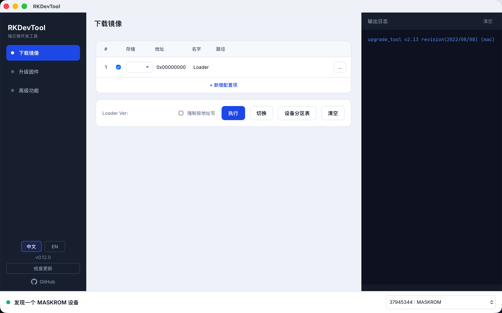
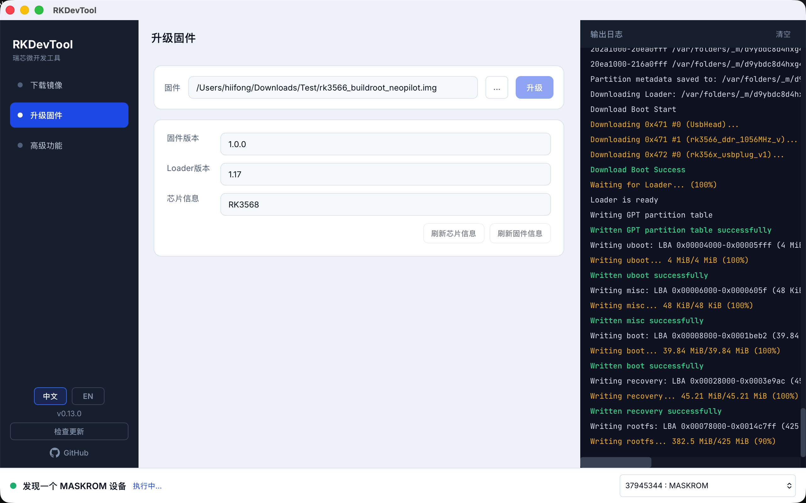
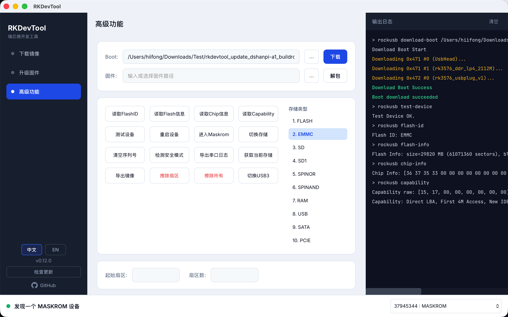

# RKDevTool

Cross-platform Rockchip USB flashing GUI built with [Tauri 2](https://v2.tauri.app/) + Vue 3. The project is actively moving toward a pure Rust/RockUSB implementation.

瑞芯微 USB 烧录工具的跨平台桌面 GUI，基于 Tauri 2 + Vue 3。项目正在积极迁移至纯 Rust/RockUSB 实现。

**[English](#english)** · **[中文](#中文)**

## Screenshots

### Download Image / 下载镜像



### Upgrade Firmware / 升级固件



### Advanced / 高级功能



---

## English

A modern alternative to the official Windows-only RKDevTool, with real-time logs, device polling, and native builds for macOS, Windows, and Linux. Core flashing workflows are implemented directly in Rust through RockUSB.

### Features

| Page | Description |
|------|-------------|
| **Download Image** | Flash Loader and partition images through RockUSB; supports partition-table and write-by-address modes |
| **Upgrade Firmware** | Extract an `update.img` to a temporary directory, install its Loader IDBlock, then write each partition through RockUSB |
| **Advanced** | Download Boot, extract firmware, read chip/Flash/Capability info, erase, reboot, switch storage, export images, and more |

- Auto-poll RockUSB devices; status bar shows Maskrom / Loader mode
- Live log panel with in-place progress updates (`Download Image... (xx%)`)
- Switch target device from the status bar when multiple devices are connected

### Rust / RockUSB migration status

Most day-to-day operations now use the Rust RockUSB backend directly: device discovery, Loader/Boot download, Download Image, firmware unpacking and partition flashing, Flash/Chip/Capability reads, device testing and reset, Maskrom entry, storage switching, erase, and image export.

Only a small compatibility surface still launches the official `upgrade_tool`:

- Read the device partition list (`PL`)
- Clear serial number (`SN`)
- Detect secure mode (`RSM`)
- Export serial log (`RCL`)
- Switch USB3 (`SSD`)

The bundled binary is still checked at startup and remains required for these compatibility features. Firmware Loader/IDBlock and partition writes remain native Rust/RockUSB. It will be removed from the normal flashing path as the remaining commands are implemented in Rust.

### Download

Get installers from [Releases](https://github.com/chendyxz/rkdevtool/releases):

| Platform | Format |
|----------|--------|
| macOS | `.dmg` (Apple Silicon / `aarch64`) |
| Windows | `.exe` (NSIS installer, `x86_64`, unsigned) |
| Linux | `.AppImage` / `.deb` |

> CI Artifacts from `main` branch pushes are for development only. **macOS artifacts are not notarized and Windows installers are unsigned**, so the OS warns on first launch. Use Release builds for distribution.

### Platform support

| Feature | macOS | Windows | Linux |
|---------|-------|---------|-------|
| RockUSB flashing, firmware upgrade, Download Image, Advanced | ✅ | ✅ | ✅ |
| APK install, device log (bundled ADB) | ✅ | ✅ | — |
| Replace firmware APK | ✅ | ❌ | ❌ |

Replacing an APK inside a firmware package needs the e2fsprogs toolchain (`debugfs`, `e2fsck`) plus the libsparse tools. Those binaries only ship with the macOS build, so the page is hidden on Windows.

Windows has its own prerequisites: the official Rockchip `Rockusb` driver (see below) and the fetched ADB platform-tools.

### Development

**Requirements**

- [Node.js](https://nodejs.org/) 18+
- [Rust](https://rustup.rs/) stable
- Platform deps: [Tauri prerequisites](https://v2.tauri.app/start/prerequisites/)

**Windows Rockusb driver**

Windows requires the official Rockchip `Rockusb` driver for device discovery and
flashing. Install it with Rockchip's DriverAssistant / official RKDevTool package,
then unplug and reconnect the board or re-enter Maskrom mode. In Device Manager,
the board should be bound to the Rockchip Rockusb driver rather than an unknown,
ADB, or generic WinUSB device. RKDevTool does not install or bundle this driver.

Linux extras:

```bash
sudo apt-get install libwebkit2gtk-4.1-dev libappindicator3-dev librsvg2-dev patchelf
```

**USB permissions (flashing without sudo)**

On Linux, RKDevTool needs read/write access to Rockchip USB devices (vendor ID `2207`). Without udev rules you may see USB access errors and must run with `sudo`.

| Install method | udev setup |
|----------------|------------|
| **`.deb`** | Automatic: rule is installed to `/lib/udev/rules.d/` and udev is reloaded during `apt install` |
| **AppImage** | Run once: `sudo packaging/linux/install-udev.sh` (from the repo) or copy the rule manually |
| **From source** | Manual: |

Manual / AppImage one-liner:

```bash
sudo packaging/linux/install-udev.sh
# or
sudo cp packaging/linux/99-rkdevtool-rockchip.rules /lib/udev/rules.d/
sudo udevadm control --reload-rules && sudo udevadm trigger --subsystem-match=usb
```

Unplug/replug the device (or re-enter Maskrom), then launch RKDevTool as a normal user. Do **not** run the GUI with `sudo` unless necessary.

**`upgrade_tool` compatibility binaries**

The application still bundles Rockchip SDK `upgrade_tool` files for the small set of compatibility commands listed above. Place them under:

```
src-tauri/bin/
├── mac/                 # upgrade_tool, config.ini, revision.txt
├── linux_x86-64/
└── windows_x86-64/
```

Use **v2.44+** when possible. The bundled Mac tool (v2.13) has incomplete support for newer chips (e.g. RK3576); use a newer SDK binary when the remaining compatibility commands require it.

**Bundled ADB**

The APK install and device log pages run a bundled ADB instead of a system install:

| Platform | Location | Source |
|----------|----------|--------|
| macOS | `src-tauri/resources/platform-tools/macos-arm64/adb` | committed |
| Windows | `src-tauri/resources/platform-tools/windows-x86_64/` (`adb.exe` + `AdbWinApi.dll`, `AdbWinUsbApi.dll`) | downloaded, not committed |
| Linux | not bundled yet | — |

On Windows run the fetch script once before building (CI runs it automatically). It pulls Google's official `platform-tools-latest-windows.zip`:

```bash
packaging/windows/fetch-platform-tools.sh
```

**Run locally**

```bash
npm install
npm run tauri dev
```

**Build**

```bash
npm run tauri build
```

Output: `src-tauri/target/release/bundle/`

### Release (maintainers)

Pushing a `v*` tag triggers GitHub Actions to build the macOS and Windows packages and publish them to the same Release (`windows-latest` produces an unsigned NSIS installer, `macos-latest` an Apple Silicon `.dmg`):

```bash
git tag v0.1.0
git push origin v0.1.0
```

Windows needs no extra secret beyond the updater signing key:

| Secret | Used by | Description |
|--------|---------|-------------|
| `TAURI_SIGNING_PRIVATE_KEY` | both | `tauri signer` private key content (never commit it) |
| `TAURI_SIGNING_PRIVATE_KEY_PASSWORD` | both | Key password, may be empty |

Both jobs merge their platform entry into the Release `latest.json`, and use the same `concurrency` group so the merges cannot overwrite each other. Windows auto-update uses NSIS with the `passive` install mode configured in `tauri.conf.json`.

macOS signing & notarization secrets:

| Secret | Description |
|--------|-------------|
| `APPLE_CERTIFICATE` | **Developer ID Application** cert (.p12, base64) |
| `APPLE_CERTIFICATE_PASSWORD` | Password used when exporting .p12 |
| `KEYCHAIN_PASSWORD` | Temporary CI keychain password |
| `APPLE_ID` | Apple ID email |
| `APPLE_PASSWORD` | [App-specific password](https://appleid.apple.com) |
| `APPLE_TEAM_ID` | Developer Team ID |

### Tech stack

- **Frontend**: Vue 3 + TypeScript + Vite
- **Backend**: Rust (Tauri 2 commands, `rockusb` protocol implementation, limited `upgrade_tool` compatibility subprocesses)
- **Design**: Penpot specs in `design/`

---

## 中文

相比官方仅支持 Windows 的工具，RKDevTool 提供 macOS / Linux 原生版本、实时日志输出与现代界面。核心烧录流程已直接通过 Rust/RockUSB 实现。

### 功能

| 页面 | 说明 |
|------|------|
| **下载镜像** | 通过 RockUSB 按分区表烧录 Loader / 各分区镜像，支持按地址写入 |
| **升级固件** | 将 `update.img` 解包到临时目录，安装 Loader IDBlock 后通过 RockUSB 写入各分区 |
| **高级功能** | 下载 Boot、解包固件、读取芯片/Flash/Capability 信息，以及擦除、重启、切换存储、导出镜像等操作 |

- 自动轮询 RockUSB 设备，状态栏显示当前连接模式（Maskrom / Loader）
- 实时日志面板，进度行原地刷新（`Download Image... (xx%)`）
- 多设备时可在状态栏切换目标设备

### Rust / RockUSB 迁移进度

目前绝大多数日常操作已由 Rust RockUSB 后端直接完成：设备发现、Loader / Boot 下载、下载镜像、固件解包与分区写入、Flash / 芯片 / Capability 信息读取、设备测试与重启、进入 Maskrom、切换存储、擦除和导出镜像。

当前仅有少量兼容功能仍会调用官方 `upgrade_tool`：

- 读取设备分区表（`PL`）
- 清空序列号（`SN`）
- 检测安全模式（`RSM`）
- 导出串口日志（`RCL`）
- 切换 USB3（`SSD`）

应用启动时仍会检查内置二进制，且上述兼容功能仍需要它。固件 Loader/IDBlock 和分区写入均由原生 Rust/RockUSB 完成。随着剩余命令被逐步实现为 Rust，正常刷机流程对官方工具的依赖将继续缩小。

### 下载

在 [Releases](https://github.com/chendyxz/rkdevtool/releases) 获取安装包：

| 平台 | 格式 |
|------|------|
| macOS | `.dmg`（Apple Silicon / `aarch64`） |
| Windows | `.exe`（NSIS 安装包，`x86_64`，未签名） |
| Linux | `.AppImage` / `.deb` |

> push `main` 分支的 CI Artifacts 仅供开发测试，**macOS 未公证、Windows 未签名**，首次打开时系统会给出风险提示。请从 Release 下载正式版。

### 平台支持

| 功能 | macOS | Windows | Linux |
|------|-------|---------|-------|
| RockUSB 刷机、升级固件、下载镜像、高级功能 | ✅ | ✅ | ✅ |
| 安装 APK / 设备日志（内置 ADB） | ✅ | ✅ | — |
| 替换固件 APK | ✅ | ❌ | ❌ |

替换固件内 APK 依赖 e2fsprogs 工具链（`debugfs`、`e2fsck`）与 libsparse 工具，这些二进制只随 macOS 构建打包，因此 Windows 上会隐藏该页面。

Windows 另有两个前置条件：瑞芯微官方 `Rockusb` 驱动（见下文）和下载好的 ADB platform-tools。

### 开发

**环境要求**

- [Node.js](https://nodejs.org/) 18+
- [Rust](https://rustup.rs/) stable
- 平台依赖见 [Tauri 前置条件](https://v2.tauri.app/start/prerequisites/)

**Windows Rockusb 驱动**

Windows 下必须安装瑞芯微官方 `Rockusb` 驱动，设备发现和烧录功能才能正常工作。
请使用瑞芯微 DriverAssistant 软件包安装驱动，然后重新插拔设备，
或重新进入 Maskrom 模式。在设备管理器中，应确认设备已绑定 Rockchip Rockusb 驱动，
而不是未知设备、ADB 驱动或通用 WinUSB 驱动。RKDevTool 不会自动安装或内置该驱动。

Linux 额外依赖：

```bash
sudo apt-get install libwebkit2gtk-4.1-dev libappindicator3-dev librsvg2-dev patchelf
```

**USB 权限（免 sudo 刷机）**

Linux 下 RKDevTool 需要访问瑞芯微 USB 设备（厂商 ID `2207`）。未配置 udev 时可能出现 USB 访问错误，只能使用 `sudo` 刷机。

| 安装方式 | udev 配置 |
|----------|-----------|
| **`.deb`** | 自动：安装时写入 `/lib/udev/rules.d/` 并 reload udev |
| **AppImage** | 需执行一次：`sudo packaging/linux/install-udev.sh` |
| **源码运行** | 手动配置（见下） |

手动 / AppImage 一次性命令：

```bash
sudo packaging/linux/install-udev.sh
# 或
sudo cp packaging/linux/99-rkdevtool-rockchip.rules /lib/udev/rules.d/
sudo udevadm control --reload-rules && sudo udevadm trigger --subsystem-match=usb
```

重新插拔设备或重新进入 Maskrom 后，以普通用户启动 RKDevTool 即可。除非必要，**不要用 `sudo` 运行图形界面**。

**`upgrade_tool` 兼容二进制**

应用仍会为上述少量兼容命令打包瑞芯微 SDK 中的 `upgrade_tool`，请将其放入对应目录：

```
src-tauri/bin/
├── mac/                 # upgrade_tool, config.ini, revision.txt
├── linux_x86-64/
└── windows_x86-64/
```

建议使用 **v2.44+** 版本。Mac 自带旧版（v2.13）对部分新芯片（如 RK3576）支持不完整；需要使用剩余兼容功能时，可从 Linux/Windows SDK 包中获取较新版本替换。

**内置 ADB**

安装 APK 与设备日志页面调用的是内置 ADB，不依赖系统安装的 adb：

| 平台 | 位置 | 来源 |
|------|------|------|
| macOS | `src-tauri/resources/platform-tools/macos-arm64/adb` | 已入库 |
| Windows | `src-tauri/resources/platform-tools/windows-x86_64/`（`adb.exe` 与 `AdbWinApi.dll`、`AdbWinUsbApi.dll`） | 脚本下载，不入库 |
| Linux | 暂未内置 | — |

Windows 下构建前先执行一次下载脚本（CI 会自动执行），它从 Google 官方 `platform-tools-latest-windows.zip` 提取：

```bash
packaging/windows/fetch-platform-tools.sh
```

**本地运行**

```bash
npm install
npm run tauri dev
```

**构建**

```bash
npm run tauri build
```

产物位于 `src-tauri/target/release/bundle/`。

### 发布（维护者）

GitHub Actions 在 push `v*` tag 时自动构建 macOS 与 Windows 安装包，并发布到同一个 Release（`windows-latest` 产出未签名的 NSIS 安装包，`macos-latest` 产出 Apple Silicon `.dmg`）：

```bash
git tag v0.1.0
git push origin v0.1.0
```

Windows 除自动更新签名密钥外无需额外 Secret：

| Secret | 使用方 | 说明 |
|--------|--------|------|
| `TAURI_SIGNING_PRIVATE_KEY` | 两个平台 | `tauri signer` 生成的私钥内容（勿提交仓库） |
| `TAURI_SIGNING_PRIVATE_KEY_PASSWORD` | 两个平台 | 私钥密码，可留空 |

两个 job 都会把自己的平台条目合并进 Release 的 `latest.json`，并用同一个 `concurrency` group 串行执行，避免互相覆盖。Windows 自动更新使用 `tauri.conf.json` 中配置的 NSIS `passive` 安装模式。

macOS 签名与公证需在仓库 Secrets 中配置：

| Secret | 说明 |
|--------|------|
| `APPLE_CERTIFICATE` | **Developer ID Application** 证书（.p12 base64） |
| `APPLE_CERTIFICATE_PASSWORD` | 导出 .p12 时的密码 |
| `KEYCHAIN_PASSWORD` | CI 临时钥匙串密码 |
| `APPLE_ID` | Apple ID 邮箱 |
| `APPLE_PASSWORD` | [应用专用密码](https://appleid.apple.com) |
| `APPLE_TEAM_ID` | Developer Team ID |

### 技术栈

- **前端**：Vue 3 + TypeScript + Vite
- **后端**：Rust（Tauri 2 命令、`rockusb` 协议实现，以及少量 `upgrade_tool` 兼容子进程）
- **设计**：Penpot 设计稿，见 `design/`

---
